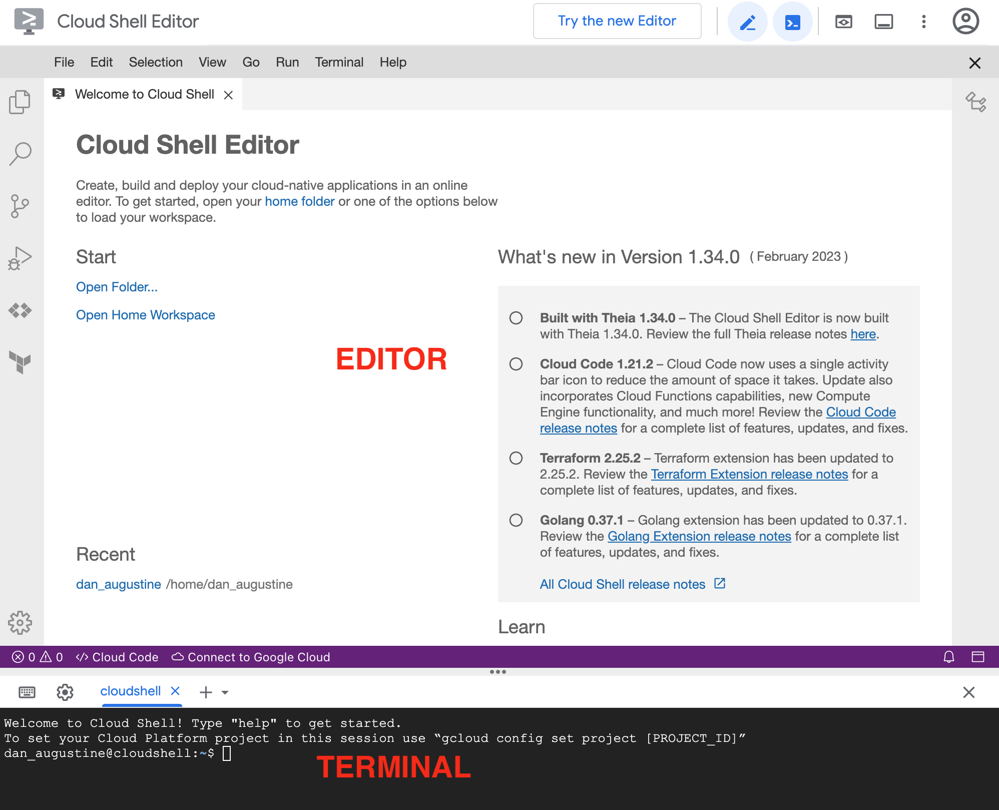
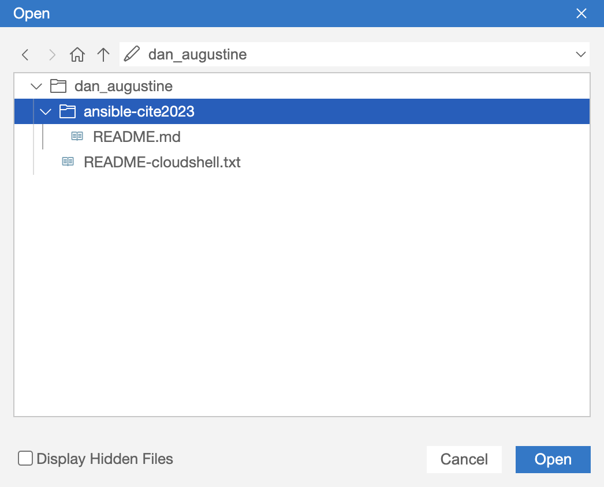
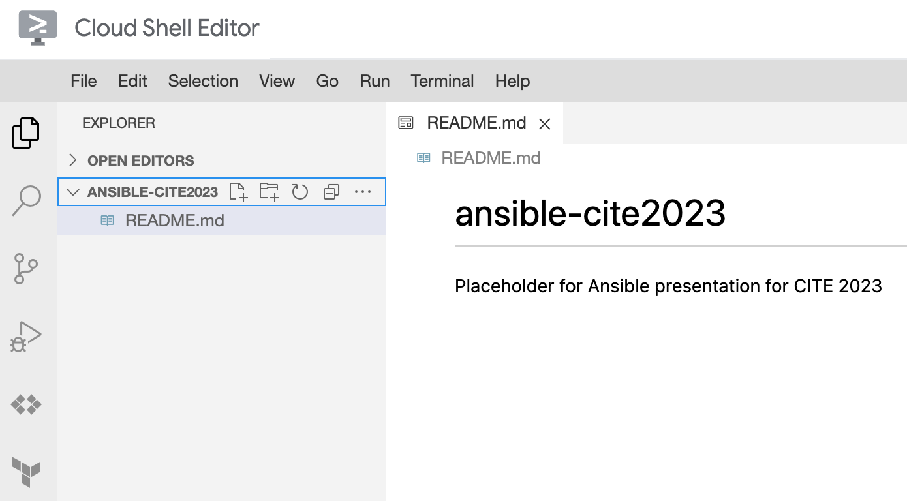
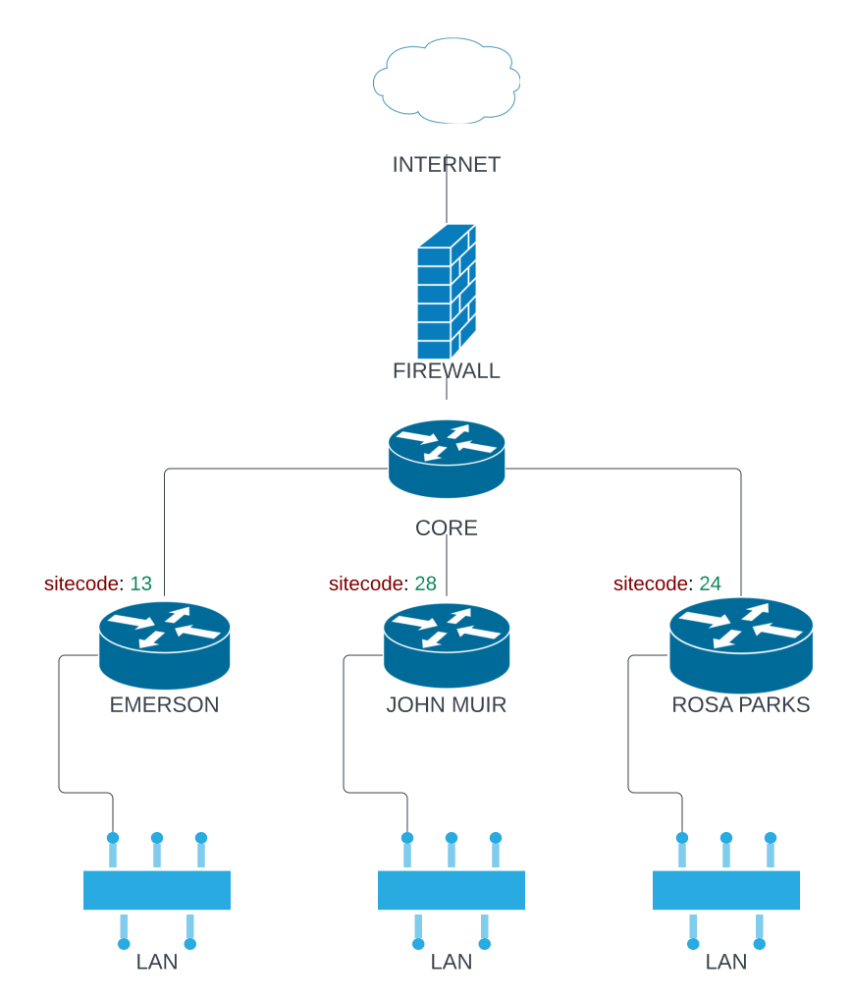

# Welcome to Fun with Ansible for CITE 2023

_Novemeber 30, 2023 - https://go.ousd.org/ansible_

---

## Presentation slides

Google Presentation [slides](https://docs.google.com/presentation/d/1vDlhoflZF2kDeqWS1Akn29r06NjpkyyxHo_-NFKiOTY/edit#slide=id.g230dd433307_0_56) for Nov 30, 2024

---

## STEP 1: Open your to Google Cloud Shell Editor

While logged into your district's Google account using a Chrome browser, go to 

> https://shell.cloud.google.com/?hl=en_US&embeddededitor=true&disableeditorautomaximize=false&fromcloudshell=true&show=ide%2Cterminal

If all goes well, you should see this after 30 seconds: 



---

## STEP 2: Install Ansible 

Run the following commands 

```
pip install netaddr ansible
export "PATH=$PATH:/home/$USER/.local/bin"
```

---


## STEP 3

STEP 3: Install Sample Files

Copy and paste the following into the terminal

```
git clone https://github.com/danaugustine/ansible-cite2023.git 
```


After git completes, go to File → Open in the editor and select "ansible-cite2023". Click Open. 



This will display this folder within the explorer:



---

## LAB 2

Network Diagram



To run playbook

```
cd ansible-cite2023/lab2
ansible-playbook router_playbook.yml
```
